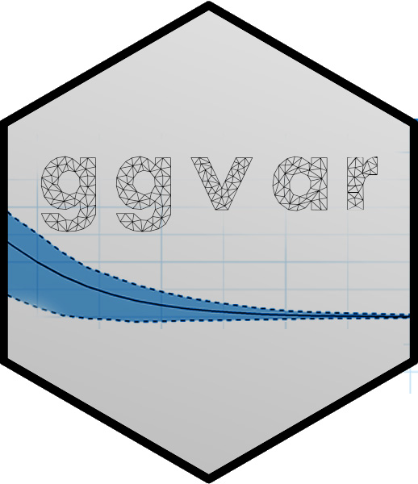

# ggmodel 

This package aims to offer complementary data visualizations, based on ggplot, building on the objects of different R packages for statistical and econometric modeling.
The package is compatible with:
* R package "MatchIt" by Ho, Imai, King, Stuart, Whitworth [link](https://cran.r-project.org/web/packages/MatchIt/MatchIt.pdf)
* R package "vars" by Pfaff et Stigler [link](https://cran.r-project.org/web/packages/vars/vars.pdf)
* R package "panelvar" by Sigmund et Ferstl [link](https://cran.r-project.org/web/packages/panelvar/panelvar.pdf)

It aims to make your life easier by providing functions to transform model outputs to tidy format, which builds the baseline to creating beautiful ggplot-based visualizations.
Next to the advantage of being able to apply various customizations in ggplot, using ggsave() you can easily output the plots for presentations and publications. Also, using the gganimate package [link](https://gganimate.com/) you can prepare animated plots (compatible with Microsoft PowerPoint).

## Density Comparison
Building on models created via MatchIt
*Under development*

## Impulse Response Functions (IRF)
Building on models created via vars and panelvar
*Under development*

## Forecast Error Variance Decomposition
Building on models created via vars and panelvar
*Under development*

